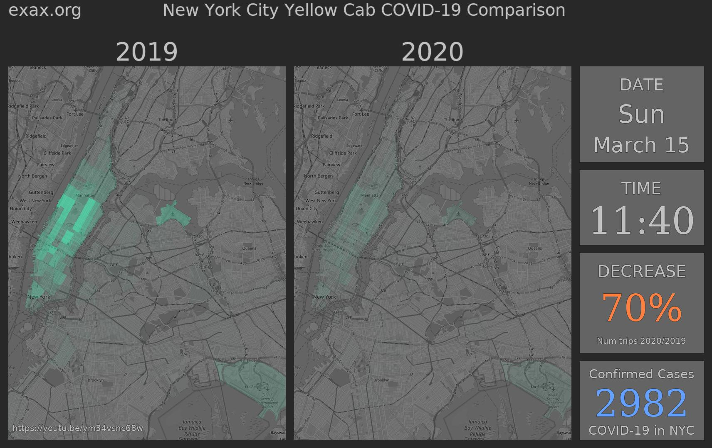

Visualise COVID-19 Lockdown using NYC Taxi Data
==================================================================

*Exax PyCon SE 2020 Talk*




This repository contains the source code and data fetching
instructions for the talk "Video of Corona Lockdown using Exax" by
*Anders Berkeman*, *Carl Drougge*, and *Sofia Hörberg*, presented at
[PyCon SE](https://pycon.se) 2020-11-13.

By cloning the repository and following the instructions in this
readme, a movie file similar to [this one on Youtube](https://youtu.be/ym34vsnc68w) will be generated.


Fetch Data
----------

```
git clone https://github.com/exaxorg/pycon20-nyc-taxi-covid-movie
cd pycon20-nyc-taxi-covid-movie
cd data

# taxi logs
wget https://s3.amazonaws.com/nyc-tlc/trip+data/yellow_tripdata_2020-03.csv
wget https://s3.amazonaws.com/nyc-tlc/trip+data/yellow_tripdata_2019-03.csv

# taxi zone polygons
wget -O zones.json 'https://data.cityofnewyork.us/api/geospatial/d3c5-ddgc?method=export&format=GeoJSON'

# COVID-19 statistics
wget https://raw.githubusercontent.com/nychealth/coronavirus-data/master/case-hosp-death.csv
```


Prerequisites
-------------

To create h.264-movies, you need to have [ffmpeg](https://ffmpeg.org)
installed.  (Without it, you can still watch the individual frames
using an image viewer.)  On a Debian-based system, do `apt-get install
ffmpeg`

If there is an error from ImageFont saying "OSError: cannot open
resource", the required fonts are not installed.  On a Debian-based
system, do `apt-get install fonts-dejavu-core`

This will not run on Windows, sorry. (WSL probably works.)


Build
-----

### In a terminal
```
cd pycon20-nyc-taxi-covid-movie
python3 -m venv venv
source venv/bin/activate
pip install accelerator pillow requests
ax server
```

### In a second terminal (with ax server running)
```
cd pycon20-nyc-taxi-covid-movie
source venv/bin/activate

# Run this once to import the taxi data
ax run import

# Run this to create the movie
ax run
# You can press CTRL-T while waiting for more verbose progress indication.

# Now, check output in ./results/-directory or in your web browser.
# And try ax --help if you're curious.
```

### In a web browser

Point to http://localhost:8520

### Full lenght movie

To save you time you only got the first day of the movie.
Look in `./dev/build.py` if you want the whole thing.


This is an Exax Accelerator project
-----------------------------------

This means that
 - processing is carried out in parallel, where possible,
 - project is completely traceable and reproducible, and
 - everything is written in Python.

The Accelerator is an open source (Apache V2) project.  See
https://exax.org for more information.
